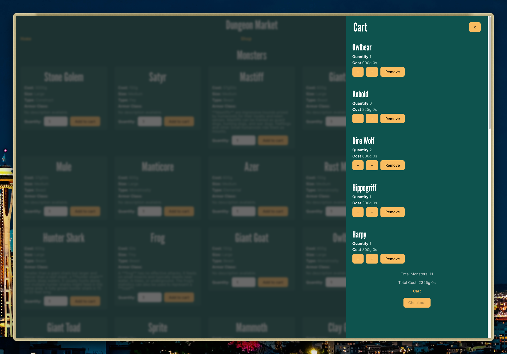

# # Dungeon Market

Dungeon Market is beginning as a shopping cart application. You can add monsters to your cart dynamically with costs shown based on the CR of the monsters.

However, the next step is to delve further. I envision it as a tool to help DMs prepare scenarios for their campaigns. DMs can build "carts" of monsters to prepare encounters. Quickly view the CR of the monsters and the encounter.

[Click here to see a live-preview hosted on Vercel).](https://dungeon-market.vercel.app/monsters/)

## Table of Contents

- [General Information](#general-information)
- [Acknowledgements](#acknowledgements)
- [Reporting Issues / Feedback / Contact](#reporting-issuesfeedbackcontact)

## General Information

This project uses:

- TypeScript
- React
- React Router
- React Testing Library
- Vite
- Vitest
- [Open5e API](https://open5e.com/)

## Acknowledgements

- [The Odin Project](https://www.theodinproject.com) and the Discord community!
- [Open5e](https://open5e.com/)

## Reporting Issues/Feedback/Contact

Bug reports are greatly appreciated. You may create a new issue with a description of the problem, and the steps leading up to it. PRs are welcome as well.
